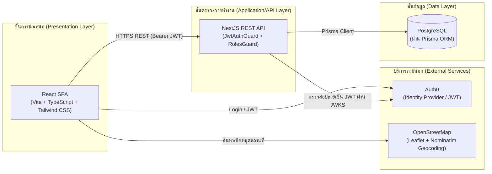

# บทที่ 1 บทนำ

## 1.1 ความเป็นมาและความสำคัญของปัญหา

ธุรกิจรับจัดเลี้ยงนอกสถานที่ (Catering Service) เป็นธุรกิจที่มีลักษณะการให้บริการเฉพาะกิจ (Event-based) ซึ่งต้องอาศัยการประสานงานหลายด้านพร้อมกันในเวลาจำกัด ทั้งการตรวจสอบคิวงานว่างในแต่ละวัน การคำนวณราคาตามจำนวนโต๊ะและระยะทาง การจัดสรรเมนูอาหารตามแพ็กเกจที่ลูกค้าเลือก การประเมินจำนวนพนักงานที่ต้องใช้ในแต่ละงาน ตลอดจนการออกเอกสารใบเสนอราคาและใบยืนยันการจองให้ลูกค้า

ในทางปฏิบัติ ร้านรับจัดเลี้ยงขนาดกลางและขนาดย่อม (SME) จำนวนมากยังคงดำเนินกระบวนการเหล่านี้ด้วยวิธีดั้งเดิม เช่น การรับจองผ่านโทรศัพท์หรือแอปพลิเคชันแชท (เช่น Line) การจดบันทึกคิวงานลงสมุดหรือปฏิทินกระดาษ และการจัดทำเอกสารใบเสนอราคา/ใบจองด้วยโปรแกรมสำนักงานทั่วไป ซึ่งก่อให้เกิดปัญหาหลายประการ ได้แก่

- **ความเสี่ยงต่อการจองซ้อนวัน/ช่วงเวลาเดียวกัน** เนื่องจากไม่มีระบบกลางที่แสดงสถานะคิวงานแบบเรียลไทม์ให้ทั้งเจ้าของร้านและลูกค้าเห็นตรงกัน
- **ความคลาดเคลื่อนในการคำนวณราคาและค่าขนส่ง** ที่ขึ้นกับปัจจัยหลายตัวร่วมกัน (จำนวนโต๊ะ พื้นที่ให้บริการ ระยะทาง) หากคำนวณด้วยมืออาจผิดพลาดหรือไม่สม่ำเสมอ
- **การประเมินจำนวนพนักงานหน้างานที่ไม่เป็นระบบ** เจ้าของร้านต้องอาศัยประสบการณ์ส่วนตัวในการประมาณจำนวนพนักงานเสิร์ฟ พ่อครัว ผู้ช่วย และพนักงานล้างจานในแต่ละงาน ซึ่งอาจนำไปสู่การจัดพนักงานเกินหรือขาดจากความต้องการจริง
- **ภาระงานเอกสารซ้ำซ้อน** การจัดทำใบเสนอราคาและใบจองที่ต้องกรอกข้อมูลรายละเอียดงานซ้ำ ๆ ด้วยมือ เสี่ยงต่อความผิดพลาดและใช้เวลานาน
- **ขาดข้อมูลเชิงสถิติเพื่อการตัดสินใจ** เจ้าของร้านไม่มีเครื่องมือสรุปรายได้ จำนวนงาน หรือความนิยมของแต่ละแพ็กเกจย้อนหลัง เพื่อใช้วางแผนธุรกิจ

จากปัญหาข้างต้น งานวิจัยนี้จึงมุ่งพัฒนา **ระบบจองบริการจัดเลี้ยงนอกสถานที่ผ่านเว็บแอปพลิเคชัน** ที่ให้ลูกค้าสามารถเลือกวันเวลา สถานที่ แพ็กเกจ และเมนูอาหารได้ด้วยตนเองผ่านหน้าเว็บ พร้อมตรวจสอบเงื่อนไขพื้นที่บริการและค่าขนส่งโดยอัตโนมัติ ในขณะที่เจ้าของร้านสามารถบริหารจัดการออเดอร์ แพ็กเกจ เมนู กำลังคน และออกเอกสารต่าง ๆ ผ่านระบบหลังบ้านที่มีการคำนวณให้อัตโนมัติตามกฎเกณฑ์ที่กำหนดไว้ล่วงหน้า เพื่อลดความผิดพลาดจากการทำงานด้วยมือ และเพิ่มประสิทธิภาพการบริหารจัดการธุรกิจโดยรวม

## 1.2 วัตถุประสงค์ของการทำวิจัย

1. เพื่อออกแบบและพัฒนาเว็บแอปพลิเคชันสำหรับจองบริการจัดเลี้ยงนอกสถานที่ ที่รองรับผู้ใช้งาน 2 บทบาท คือ ลูกค้า (Customer) และเจ้าของร้าน (Owner)
2. เพื่อพัฒนาฟังก์ชันคำนวณอัตโนมัติที่จำเป็นต่อธุรกิจจัดเลี้ยง ได้แก่ การตรวจสอบคิวงานว่าง การคำนวณค่าขนส่งตามพื้นที่ให้บริการ และการประเมินจำนวนพนักงานตามจำนวนโต๊ะที่จอง
3. เพื่อพัฒนาระบบออกเอกสารใบเสนอราคาและใบจองอัตโนมัติจากข้อมูลการจองเดียวกัน ลดการจัดทำเอกสารซ้ำซ้อน
4. เพื่อพัฒนาระบบแดชบอร์ดสรุปข้อมูลเชิงสถิติ (รายได้ จำนวนงาน สัดส่วนแพ็กเกจ) สำหรับสนับสนุนการตัดสินใจของเจ้าของร้าน
5. เพื่อประเมินประสิทธิภาพและความพึงพอใจของผู้ใช้งานที่มีต่อระบบที่พัฒนาขึ้น

## 1.3 ขอบเขตของการวิจัย

1. **ขอบเขตด้านผู้ใช้งาน** ระบบรองรับผู้ใช้งาน 2 บทบาท ได้แก่ ลูกค้า (เข้าสู่ระบบด้วยบัญชี Google) และเจ้าของร้าน (เข้าสู่ระบบด้วยชื่อผู้ใช้/รหัสผ่านที่กำหนดไว้ล่วงหน้า) โดยยังไม่รวมบทบาทพนักงาน (staff) แยกต่างหาก
2. **ขอบเขตด้านฟังก์ชัน** ครอบคลุมกระบวนการจองตั้งแต่เลือกวันเวลา จำนวนโต๊ะ สถานที่จัดงาน แพ็กเกจอาหาร และเมนู ไปจนถึงการยืนยันการจอง การแนบสลิปโอนเงินมัดจำ และการออกใบเสนอราคา/ใบจอง รวมถึงระบบบริหารจัดการฝั่งเจ้าของร้าน (ออเดอร์ ปฏิทิน แพ็กเกจ เมนู เอกสาร ลูกค้า และการตั้งค่าร้าน)
3. **ขอบเขตด้านพื้นที่ให้บริการ** อ้างอิงพื้นที่ให้บริการ 3 โซน คือ พื้นที่ตั้งร้าน (จังหวัดนครปฐม) เขตกรุงเทพมหานครและปริมณฑล และพื้นที่นอกเหนือจากนั้น โดยกำหนดเงื่อนไขค่าขนส่งและจำนวนโต๊ะขั้นต่ำตามโซนที่ตั้งค่าได้
4. **ขอบเขตด้านเทคโนโลยี** พัฒนาเป็นเว็บแอปพลิเคชัน (Responsive Web Application) ไม่รวมแอปพลิเคชันมือถือแบบ Native ใช้ Auth0 เป็นผู้ให้บริการยืนยันตัวตน (Identity Provider) ภายนอก และใช้บริการค้นหาพิกัด/แผนที่จาก OpenStreetMap (Nominatim + Leaflet) ซึ่งเป็นบริการสาธารณะแบบไม่มีค่าใช้จ่าย
5. **ขอบเขตที่ไม่รวมในงานวิจัยนี้** ได้แก่ ระบบชำระเงินออนไลน์ผ่านช่องทางธนาคาร/บัตรเครดิตโดยตรง (ปัจจุบันใช้การแนบหลักฐานการโอนเงินให้เจ้าของร้านตรวจสอบเอง) ระบบแจ้งเตือนแบบ Push Notification/SMS จริง และการรองรับหลายภาษา (ระบบพัฒนาเป็นภาษาไทยเพียงภาษาเดียว)

## 1.4 ประโยชน์ที่คาดว่าจะได้รับ

1. ลูกค้าสามารถจองบริการจัดเลี้ยงได้ด้วยตนเองผ่านเว็บไซต์ตลอด 24 ชั่วโมง โดยเห็นราคา เงื่อนไข และสถานะคิวงานที่ชัดเจนก่อนตัดสินใจจอง
2. เจ้าของร้านลดระยะเวลาและความผิดพลาดในการคำนวณราคา ค่าขนส่ง และจำนวนพนักงานที่ต้องใช้ในแต่ละงาน
3. ลดภาระงานเอกสารซ้ำซ้อนจากการจัดทำใบเสนอราคาและใบจองด้วยมือ
4. เจ้าของร้านมีข้อมูลเชิงสถิติ (รายได้ จำนวนงาน แพ็กเกจยอดนิยม) เพื่อประกอบการตัดสินใจวางแผนธุรกิจ
5. ได้ต้นแบบระบบ (Prototype) ที่ธุรกิจจัดเลี้ยงขนาดกลางและขนาดย่อมอื่น ๆ สามารถนำแนวคิดและสถาปัตยกรรมไปประยุกต์ใช้ต่อยอดได้

---

# บทที่ 2 เอกสารและงานวิจัยที่เกี่ยวข้อง

## 2.1 แนวคิดและทฤษฎีที่เกี่ยวข้อง

### 2.1.1 สถาปัตยกรรมเว็บแอปพลิเคชันแบบ Client-Server และ Single Page Application (SPA)

ระบบพัฒนาโดยแยกส่วนการทำงานออกเป็นฝั่งไคลเอนต์ (Frontend) และฝั่งเซิร์ฟเวอร์ (Backend) อย่างชัดเจนตามแนวคิด Client-Server Architecture โดยฝั่งไคลเอนต์พัฒนาเป็น Single Page Application (SPA) ด้วย React ซึ่งเบราว์เซอร์โหลดหน้าเว็บเพียงครั้งเดียวแล้วอัปเดตเนื้อหาผ่าน JavaScript โดยไม่ต้องโหลดหน้าใหม่ทั้งหมด ช่วยให้ประสบการณ์ผู้ใช้งานลื่นไหลใกล้เคียงแอปพลิเคชันเดสก์ท็อป

### 2.1.2 สถาปัตยกรรม RESTful API

ฝั่งเซิร์ฟเวอร์ออกแบบเป็น RESTful API ตามแนวคิด Representational State Transfer ซึ่งใช้ HTTP Method (GET, POST, PATCH, DELETE) สื่อสารกับทรัพยากร (Resource) ผ่าน endpoint ที่มีโครงสร้างชัดเจน (เช่น `/bookings`, `/menus`, `/packages`) ทำให้ฝั่งไคลเอนต์และเซิร์ฟเวอร์แยกพัฒนาและทดสอบเป็นอิสระจากกันได้

### 2.1.3 การพัฒนาโปรแกรมเชิงองค์ประกอบ (Component-Based Development)

React ใช้แนวคิดการแบ่งส่วนติดต่อผู้ใช้ (UI) ออกเป็นหน่วยย่อยที่เรียกว่า Component ซึ่งสามารถนำกลับมาใช้ซ้ำ (Reusable) และจัดการสถานะ (State) ของตนเองได้ ช่วยให้การพัฒนาและบำรุงรักษาโค้ดของระบบที่มีหลายหน้าจอ (เช่น ขั้นตอนการจอง 6 ขั้นตอน และหน้าบริหารจัดการฝั่งเจ้าของร้าน 8 หน้าจอ) เป็นระบบระเบียบมากขึ้น

### 2.1.4 การยืนยันตัวตนและการควบคุมสิทธิ์การเข้าถึง (Authentication และ Role-Based Access Control)

ระบบใช้แนวคิด OAuth 2.0 / OpenID Connect ผ่านผู้ให้บริการภายนอก (Auth0) ในการยืนยันตัวตนผู้ใช้ และใช้ JSON Web Token (JWT) เป็นรูปแบบข้อมูลสำหรับส่งต่อสถานะการยืนยันตัวตนระหว่างไคลเอนต์กับเซิร์ฟเวอร์ ฝั่งเซิร์ฟเวอร์ตรวจสอบความถูกต้องของ JWT ด้วยกุญแจสาธารณะที่เผยแพร่ผ่าน JWKS (JSON Web Key Set) โดยไม่จำเป็นต้องเก็บรหัสผ่านผู้ใช้ไว้เอง จากนั้นระบบใช้แนวคิด Role-Based Access Control (RBAC) ในการจำกัดสิทธิ์การเข้าถึงแต่ละฟังก์ชันตามบทบาทผู้ใช้ (ลูกค้า/เจ้าของร้าน)

### 2.1.5 การออกแบบฐานข้อมูลเชิงสัมพันธ์ (Relational Database Design)

ระบบจัดเก็บข้อมูลด้วยฐานข้อมูลเชิงสัมพันธ์ (PostgreSQL) ผ่านเครื่องมือ Object-Relational Mapping (ORM) เพื่อจำลองความสัมพันธ์ระหว่างข้อมูลผู้ใช้ ใบจอง แพ็กเกจ และเมนูอาหาร (ความสัมพันธ์แบบหนึ่งต่อกลุ่ม และกลุ่มต่อกลุ่ม) ตามหลักการออกแบบฐานข้อมูลเพื่อลดความซ้ำซ้อนของข้อมูล (Normalization)

### 2.1.6 ระบบสารสนเทศภูมิศาสตร์และการระบุพิกัด (Geocoding)

ระบบนำแนวคิดระบบสารสนเทศภูมิศาสตร์ (Geographic Information System) มาประยุกต์ใช้ในการระบุตำแหน่งสถานที่จัดงานบนแผนที่ (ผ่านไลบรารี Leaflet) และแปลงพิกัดพื้นที่เป็นชื่อสถานที่/ที่อยู่ (Reverse Geocoding) และค้นหาสถานที่จากคำค้น (Forward Geocoding) ผ่านบริการ Nominatim ของ OpenStreetMap เพื่อใช้จัดกลุ่มพื้นที่ให้บริการและคำนวณค่าขนส่ง

### 2.1.7 วงจรการพัฒนาซอฟต์แวร์ (Software Development Life Cycle)

การดำเนินงานวิจัยอ้างอิงแนวคิดวงจรการพัฒนาซอฟต์แวร์ ประกอบด้วยขั้นตอนการวิเคราะห์ความต้องการ การออกแบบระบบ การพัฒนา การทดสอบ และการประเมินผล ซึ่งจะกล่าวถึงรายละเอียดในบทที่ 3

## 2.2 งานวิจัยที่เกี่ยวข้อง

การทบทวนวรรณกรรมสำหรับงานวิจัยนี้ควรครอบคลุมกลุ่มหัวข้องานวิจัยที่เกี่ยวข้องดังต่อไปนี้ เพื่อใช้เปรียบเทียบแนวทาง จุดเด่น และข้อจำกัดกับระบบที่พัฒนาขึ้น:

1. **งานวิจัยด้านระบบจอง/ระบบจองคิวออนไลน์ (Online Booking/Reservation System)** สำหรับธุรกิจบริการประเภทต่าง ๆ เช่น ร้านอาหาร โรงแรม สถานที่จัดงาน เพื่อศึกษารูปแบบการออกแบบ workflow การจอง การจัดการสถานะคิว และการป้องกันการจองซ้อน
   แหล่งที่มา: Salakham, P., & Talasee, J. (2024). ระบบบริหารจัดการร้านอาหารออนไลน์ กรณีศึกษา ร้านตู้แดง. *วารสารวิศวกรรมและเทคโนโลยีอุตสาหกรรม มหาวิทยาลัยกาฬสินธุ์*. https://ph03.tci-thaijo.org/index.php/JEIT/article/view/2212

2. **งานวิจัยด้านการประยุกต์ใช้สถาปัตยกรรม RESTful API ร่วมกับ Single Page Application** ในการพัฒนาระบบธุรกิจขนาดกลางและขนาดย่อม (SME) เพื่อศึกษาแนวทางการแบ่งชั้นสถาปัตยกรรมและการสื่อสารระหว่าง Frontend/Backend
   แหล่งที่มา:
   - Sakda, S., Nunsong, V., & Na Suhlong, W. (2025). การพัฒนาเว็บเซอร์วิสบริการข้อมูลการฝึกประสบการณ์วิชาชีพและสหกิจศึกษาแบบ RESTful API. *วารสารวิชาการ การจัดการเทคโนโลยี มหาวิทยาลัยราชภัฏมหาสารคาม*. https://ph02.tci-thaijo.org/index.php/itm-journal/article/view/256701
   - เขียวอิ่ม, พ., และ แสงใส, อ. (2024). การพัฒนาระบบจัดการคลังสินค้าโดยใช้สถาปัตยกรรม RESTful API. *วารสารวิชาการวิทยาศาสตร์และเทคโนโลยี มหาวิทยาลัยราชภัฏธนบุรี*. https://li04.tci-thaijo.org/index.php/scidru/article/view/1731

3. **งานวิจัยด้านการยืนยันตัวตนแบบ Role-Based Access Control ด้วย OAuth 2.0 / JWT** เพื่อศึกษาวิธีการออกแบบระบบสิทธิ์การเข้าถึงหลายบทบาทในเว็บแอปพลิเคชัน
   แหล่งที่มา: Bucko, A., Vishi, K., Krasniqi, B., & Rexha, B. (2023). Enhancing JWT authentication and authorization in web applications based on user behavior history. *Computers*, 12(4), 78. https://www.mdpi.com/2073-431X/12/4/78

4. **งานวิจัยด้านระบบสนับสนุนการตัดสินใจ (Decision Support System) เชิงแดชบอร์ด** สำหรับผู้ประกอบการ SME เพื่อศึกษาการนำเสนอข้อมูลเชิงสถิติที่ช่วยการวางแผนธุรกิจ
   แหล่งที่มา: Munghmai, R., Kuauta, V., & Thanisphong, K. (2023). การพัฒนาระบบสนับสนุนการตัดสินใจสำหรับผู้ประกอบการวิสาหกิจขนาดกลางและขนาดย่อมในเขตภาคตะวันออกเฉียงเหนือตอนล่าง 2. *วารสารมหาวิทยาลัยราชภัฏลำปาง*. https://so04.tci-thaijo.org/index.php/JLPRU/article/view/245388

5. **งานวิจัยด้านการประยุกต์ใช้ระบบสารสนเทศภูมิศาสตร์ในงานโลจิสติกส์/การคำนวณค่าขนส่งตามพื้นที่** เพื่อศึกษาวิธีการกำหนดโซนบริการและคิดค่าใช้จ่ายตามระยะทาง/พื้นที่
   แหล่งที่มา:
   - Thupthimtian, T., Srisawat, P., & Pronnan, K. (2022). การปรับปรุงการจัดการโลจิสติกส์ในการช่วยเหลือผู้ประสบอุทกภัยด้วยการประยุกต์ใช้ระบบสารสนเทศภูมิศาสตร์ในการวิเคราะห์พื้นที่เสี่ยงอุทกภัยจังหวัดพิษณุโลก. *วารสารวิชาการเทคโนโลยี มหาวิทยาลัยราชภัฏพิบูลสงคราม*. https://ph02.tci-thaijo.org/index.php/psru-jite/article/view/247181
   - เฟื่องประยูร, ธ. (2023). ปัจจัยและแนวทางการกำหนดราคาค่าขนส่งสินค้าอาหารในเขตธนบุรี กรุงเทพมหานคร. *วารสารวิทยาการจัดการ มหาวิทยาลัยราชภัฏธนบุรี*. https://so10.tci-thaijo.org/index.php/msdru/article/view/798

> **หมายเหตุ:** ลิงก์ข้างต้นสืบค้นจากฐานข้อมูล ThaiJo และวารสาร MDPI จริง ควรเปิดตรวจสอบเลขปีที่/ฉบับที่/เลขหน้าให้ครบก่อนใช้อ้างอิงในรูปแบบที่สถาบันกำหนด (เช่น APA 7th)

---

# บทที่ 3 วิธีดำเนินการวิจัย

## 3.1 System Architecture

ระบบออกแบบเป็นสถาปัตยกรรม 3 ชั้น (3-Tier Architecture) ประกอบด้วย

1. **ชั้นการนำเสนอ (Presentation Layer)** — เว็บแอปพลิเคชัน (SPA) พัฒนาด้วย React ทำหน้าที่แสดงผลหน้าจอฝั่งลูกค้าและฝั่งเจ้าของร้าน ติดต่อกับผู้ใช้งานโดยตรง
2. **ชั้นตรรกะการทำงาน (Application/API Layer)** — RESTful API พัฒนาด้วย NestJS ทำหน้าที่ประมวลผลตรรกะทางธุรกิจ (การคำนวณราคา ค่าขนส่ง กำลังคน) ตรวจสอบสิทธิ์การเข้าถึง และเป็นตัวกลางเชื่อมต่อฐานข้อมูล
3. **ชั้นข้อมูล (Data Layer)** — ฐานข้อมูลเชิงสัมพันธ์ PostgreSQL เข้าถึงผ่าน Prisma ORM

นอกจากนี้ระบบยังพึ่งพา **บริการภายนอก (External Services)** 2 ส่วน คือ

- **Auth0** ทำหน้าที่เป็นผู้ให้บริการยืนยันตัวตน (Identity Provider) แยกช่องทางเข้าสู่ระบบตามบทบาท (ลูกค้าผ่าน Google OAuth2, เจ้าของร้านผ่าน Username/Password) และฝังบทบาทผู้ใช้ (Role) ลงใน JWT ผ่าน Auth0 Action ก่อนส่งกลับให้ทั้งฝั่ง Frontend และ Backend ตรวจสอบ
- **OpenStreetMap (Leaflet + Nominatim)** ทำหน้าที่แสดงแผนที่และให้บริการค้นหา/แปลงพิกัดเป็นที่อยู่ (Geocoding/Reverse Geocoding) แบบสาธารณะโดยไม่มีค่าใช้จ่าย

รูปแบบการทำงานสรุปได้ว่า ผู้ใช้งานยืนยันตัวตนผ่าน Auth0 ก่อน ได้รับ JWT ที่มีข้อมูลบทบาทฝังอยู่ จากนั้นฝั่ง Frontend แนบ JWT นี้ไปกับทุกคำขอ (Request) ไปยัง REST API ซึ่งจะตรวจสอบความถูกต้องของ JWT และสิทธิ์การเข้าถึงก่อนประมวลผลและอ่าน/เขียนข้อมูลในฐานข้อมูล

## 3.2 เครื่องมือและเทคโนโลยีที่ใช้

### 3.2.1 ฝั่ง Frontend

| หมวด | เครื่องมือ/เทคโนโลยี | บทบาทในระบบ |
|---|---|---|
| Framework พัฒนา UI | React 19 | สร้างส่วนติดต่อผู้ใช้แบบ Component-based |
| เครื่องมือ Build | Vite 8 + `@vitejs/plugin-react` | คอมไพล์และรัน dev server ความเร็วสูง |
| ภาษาโปรแกรม | TypeScript 5.7 | เพิ่มความปลอดภัยของชนิดข้อมูล (Type Safety) |
| การจัดรูปแบบหน้าเว็บ | Tailwind CSS v4 | กำหนดสไตล์ผ่าน Utility Class |
| การยืนยันตัวตน | `@auth0/auth0-react` v2 | เชื่อมต่อ Auth0 SDK ฝั่งไคลเอนต์ |
| แผนที่ | Leaflet 1.9 | แสดงแผนที่และปักหมุดสถานที่จัดงาน |
| ค้นหา/แปลงพิกัด | OpenStreetMap Nominatim API | ค้นหาสถานที่และแปลงพิกัดเป็นที่อยู่ |
| การแสดงผลข้อมูลเชิงสถิติ | Recharts 3 | สร้างกราฟในหน้าแดชบอร์ด |
| ไอคอน | lucide-react | ชุดไอคอนสำหรับ UI |
| การจัดรูปแบบโค้ด | oxfmt | Code formatter |
| ตัวจัดการแพ็กเกจ | pnpm | ติดตั้งและจัดการ dependency |

### 3.2.2 ฝั่ง Backend

| หมวด | เครื่องมือ/เทคโนโลยี | บทบาทในระบบ |
|---|---|---|
| Framework พัฒนา API | NestJS 11 | โครงสร้าง REST API แบบโมดูล (Module/Controller/Service) |
| ภาษาโปรแกรม | TypeScript 5.7 | เขียนโค้ดฝั่งเซิร์ฟเวอร์ |
| ORM | Prisma 6 | จัดการโครงสร้างฐานข้อมูลและ Query |
| ฐานข้อมูล | PostgreSQL 16 | จัดเก็บข้อมูลผู้ใช้ ใบจอง แพ็กเกจ เมนู และค่าตั้งค่าร้าน |
| การยืนยันตัวตน (ฝั่งเซิร์ฟเวอร์) | Passport + `passport-jwt` + `jwks-rsa` | ตรวจสอบลายเซ็น JWT ที่ Auth0 ออกให้ |
| การตรวจสอบข้อมูลนำเข้า | `class-validator` + `class-transformer` | ตรวจสอบความถูกต้องของข้อมูลที่ส่งเข้ามาผ่าน DTO |
| การจัดการค่าตั้งค่า | `@nestjs/config` | อ่านค่าตัวแปรแวดล้อม (Environment Variables) |
| Containerization (สภาพแวดล้อมพัฒนา) | Docker / Docker Compose | รันฐานข้อมูล PostgreSQL สำหรับพัฒนาในเครื่อง |

### 3.2.3 เครื่องมือสนับสนุนการพัฒนา

| หมวด | เครื่องมือ/เทคโนโลยี |
|---|---|
| ระบบควบคุมเวอร์ชัน | Git |
| ผู้ให้บริการยืนยันตัวตน | Auth0 (Identity as a Service) |
| แผนงานการ deploy | Vercel (Frontend), Railway (Backend + PostgreSQL) |

## 3.3 ขั้นตอนการดำเนินการ

การดำเนินงานวิจัยแบ่งออกเป็น 7 ขั้นตอนหลัก ดังนี้

### ขั้นตอนที่ 1 ศึกษาปัญหาระบบงานปัจจุบัน

ศึกษากระบวนการทำงานเดิมของธุรกิจรับจัดเลี้ยงนอกสถานที่ในลักษณะเดียวกับร้านพิพัฒน์โภชนา ซึ่งปัจจุบันรับจองผ่านโทรศัพท์และแอปพลิเคชันแชท (Line) โดยดำเนินการดังนี้

- สอบถาม/สัมภาษณ์เจ้าของร้านและลูกค้าถึงขั้นตอนการจองงานที่ใช้อยู่จริง ตั้งแต่การติดต่อสอบถามคิวงาน การต่อรองราคา จนถึงวันจัดงานจริง
- รวบรวมเอกสารที่ใช้งานอยู่จริง เช่น ใบเสนอราคา ใบยืนยันการจอง สมุด/ปฏิทินที่ใช้บันทึกคิวงาน
- สังเกตและบันทึกปัญหาที่เกิดขึ้นจริงระหว่างการทำงาน เช่น ความเสี่ยงจองซ้อนวัน ความผิดพลาดในการคำนวณราคา/ค่าขนส่ง/จำนวนพนักงาน และภาระงานเอกสารซ้ำซ้อน
- **ผลลัพธ์ของขั้นตอนนี้**: รายการปัญหาของระบบงานปัจจุบันที่ต้องแก้ไข ซึ่งนำไปสู่ความเป็นมาและความสำคัญของปัญหาในหัวข้อ 1.1

### ขั้นตอนที่ 2 วิเคราะห์ระบบงานปัจจุบัน

นำปัญหาที่รวบรวมได้จากขั้นตอนที่ 1 มาวิเคราะห์อย่างเป็นระบบ เพื่อกำหนดขอบเขตและความต้องการของระบบงานใหม่

- เขียนแผนภาพกระบวนการทำงานเดิม (Flowchart/Context Diagram) เพื่อระบุจุดที่เป็นปัญหาและจุดที่สามารถนำระบบคอมพิวเตอร์เข้ามาช่วยได้
- วิเคราะห์ผู้เกี่ยวข้องกับระบบ (Stakeholder) 2 กลุ่ม คือ ลูกค้าและเจ้าของร้าน พร้อมบทบาทและสิทธิ์การเข้าถึงของแต่ละกลุ่ม
- วิเคราะห์กฎเกณฑ์ทางธุรกิจที่ต้องแปลงเป็นตรรกะการคำนวณของระบบ ได้แก่ สูตรคำนวณจำนวนพนักงานตามจำนวนโต๊ะ เงื่อนไขพื้นที่ให้บริการและค่าขนส่ง และกติกาการนับคิวงานรายวัน
- จัดทำข้อกำหนดความต้องการของระบบ (Requirement Specification) ในรูปแบบรหัสความต้องการเชิงฟังก์ชัน (Functional Requirement: FR-code) แยกตามบทบาทผู้ใช้งาน
- **ผลลัพธ์ของขั้นตอนนี้**: เอกสารข้อกำหนดความต้องการของระบบ (Requirement Specification) ที่ผ่านการตรวจสอบและเห็นชอบร่วมกันระหว่างผู้วิจัยกับเจ้าของร้าน

### ขั้นตอนที่ 3 ออกแบบระบบงานใหม่

นำข้อกำหนดความต้องการจากขั้นตอนที่ 2 มาออกแบบเป็นระบบงานใหม่ ครอบคลุม

- ออกแบบสถาปัตยกรรมระบบแบบ 3 ชั้น (Presentation / Application / Data Layer) ตามหัวข้อ 3.1
- ออกแบบโครงสร้างฐานข้อมูลเชิงสัมพันธ์ (Entity-Relationship Diagram) ประกอบด้วยตารางผู้ใช้ ใบจอง แพ็กเกจ คอร์สอาหารในแพ็กเกจ เมนูอาหาร และค่าตั้งค่าร้าน
- ออกแบบ RESTful API endpoint ของแต่ละโมดูล พร้อมกำหนดสิทธิ์การเข้าถึงตามบทบาท (Role-Based Access Control)
- ออกแบบผังการยืนยันตัวตน (Authentication Flow) ผ่าน Auth0 โดยแยกช่องทางเข้าสู่ระบบตามบทบาท
- ออกแบบส่วนติดต่อผู้ใช้ (UI/UX) ของขั้นตอนการจอง 6 ขั้นตอนฝั่งลูกค้า และหน้าจอบริหารจัดการ 8 หน้าจอฝั่งเจ้าของร้าน
- **ผลลัพธ์ของขั้นตอนนี้**: เอกสารออกแบบระบบ (System Design Document) ประกอบด้วยแผนภาพสถาปัตยกรรม ER Diagram รายการ API และแบบร่างหน้าจอ (Mockup/Wireframe)

### ขั้นตอนที่ 4 พัฒนาระบบงานใหม่

นำผลการออกแบบจากขั้นตอนที่ 3 มาพัฒนาเป็นระบบจริง โดยดำเนินการคู่ขนาน 2 ส่วน

- **เตรียมสภาพแวดล้อมการพัฒนา**: ติดตั้ง Node.js, pnpm และใช้ Docker Compose รัน PostgreSQL สำหรับพัฒนาในเครื่อง พร้อมตั้งค่าระบบควบคุมเวอร์ชันด้วย Git
- **พัฒนาฝั่ง Backend**: สร้างโครงสร้างฐานข้อมูลด้วย Prisma Migration และพัฒนา RESTful API แต่ละโมดูล (ผู้ใช้ ใบจอง แพ็กเกจ เมนู ค่าตั้งค่า) ด้วย NestJS พร้อมระบบยืนยันตัวตนและตรวจสอบสิทธิ์การเข้าถึง (JwtAuthGuard/RolesGuard)
- **พัฒนาฝั่ง Frontend**: พัฒนาหน้าจอขั้นตอนการจอง 6 ขั้นตอน (เลือกวันเวลา จำนวนโต๊ะ สถานที่ แพ็กเกจ เมนู และยืนยันการจอง) หน้าประวัติการจอง และหน้าบริหารจัดการฝั่งเจ้าของร้าน 8 หน้าจอ ด้วย React, Vite และ Tailwind CSS พร้อมเชื่อมต่อการยืนยันตัวตนผ่าน Auth0 และบริการแผนที่/ค้นหาตำแหน่งผ่าน Leaflet และ Nominatim
- **เชื่อมต่อระบบ (Integration)**: เชื่อมฝั่ง Frontend เข้ากับ RESTful API ที่พัฒนาไว้ ทดแทนข้อมูลจำลอง (Mock Data) ที่ใช้ระหว่างพัฒนา และทดสอบการไหลของข้อมูลตั้งแต่การจองจนถึงการบริหารจัดการฝั่งเจ้าของร้านให้ทำงานร่วมกันได้ถูกต้อง
- **ผลลัพธ์ของขั้นตอนนี้**: ระบบต้นแบบ (Prototype) ที่ทำงานได้ครบตามข้อกำหนดความต้องการที่ออกแบบไว้

### ขั้นตอนที่ 5 ทดสอบและแก้ไขระบบงานใหม่

นำระบบต้นแบบจากขั้นตอนที่ 4 มาทดสอบตามแผนการทดสอบในหัวข้อ 3.4 ได้แก่ การทดสอบหน่วยย่อย การทดสอบการเชื่อมต่อ การทดสอบระบบโดยรวม การทดสอบแบบกล่องดำ และการทดสอบการยอมรับของผู้ใช้ (UAT)

- บันทึกข้อบกพร่อง (Bug) ที่พบระหว่างการทดสอบแต่ละระดับ พร้อมจัดลำดับความสำคัญของปัญหา
- แก้ไขข้อบกพร่องที่พบ แล้วทดสอบซ้ำ (Regression Testing) เพื่อยืนยันว่าการแก้ไขไม่ส่งผลกระทบต่อฟังก์ชันอื่น
- ทำซ้ำวงจรทดสอบ-แก้ไขจนระบบทำงานได้ถูกต้องครบถ้วนตามข้อกำหนดความต้องการ (Requirement Specification) จากขั้นตอนที่ 2
- **ผลลัพธ์ของขั้นตอนนี้**: ระบบที่ผ่านการทดสอบและแก้ไขจนมีความเสถียร พร้อมรายงานผลการทดสอบและผลการประเมินความพึงพอใจของผู้ใช้งาน

### ขั้นตอนที่ 6 สรุปผล

รวบรวมผลการดำเนินงานทั้งหมดเพื่อสรุปเป็นผลการวิจัย

- สรุปผลการดำเนินงานเทียบกับวัตถุประสงค์ของการวิจัยที่ตั้งไว้ในหัวข้อ 1.2 ว่าบรรลุผลมากน้อยเพียงใด
- สรุปผลการทดสอบและผลการประเมินความพึงพอใจของผู้ใช้งานจากขั้นตอนที่ 5
- สรุปข้อจำกัดที่พบระหว่างการพัฒนาระบบ (เช่น ขอบเขตที่ยังไม่ครอบคลุมตามหัวข้อ 1.3) และข้อเสนอแนะสำหรับการนำระบบไปพัฒนาต่อยอดในอนาคต
- **ผลลัพธ์ของขั้นตอนนี้**: บทสรุปผลการดำเนินงานวิจัยและข้อเสนอแนะ ซึ่งจะปรากฏในบทสรุปของรูปเล่มฉบับสมบูรณ์

### ขั้นตอนที่ 7 จัดทำรูปเล่มปัญหาพิเศษ

เรียบเรียงผลการดำเนินงานทั้งหมดตั้งแต่ขั้นตอนที่ 1–6 เป็นรูปเล่มรายงานฉบับสมบูรณ์

- เรียบเรียงเนื้อหาตามโครงสร้างบทที่สถาบันการศึกษากำหนด พร้อมภาคผนวก
- จัดรูปแบบเอกสารให้เป็นไปตามมาตรฐานที่กำหนด (รูปแบบตัวอักษร ระยะขอบ การอ้างอิงเอกสาร เช่น APA 7th)
- จัดเตรียมภาคผนวกประกอบ เช่น ตัวอย่างโค้ดที่พัฒนา คู่มือการใช้งานระบบ แบบสอบถามและผลการประเมินความพึงพอใจ
- ตรวจทาน (Proofread) ความถูกต้องของเนื้อหาและรูปแบบก่อนนำเสนอ/สอบป้องกันปัญหาพิเศษ
- **ผลลัพธ์ของขั้นตอนนี้**: รูปเล่มปัญหาพิเศษฉบับสมบูรณ์ที่พร้อมนำเสนอและจัดส่ง

## 3.4 การทดสอบและการประเมินผล

การทดสอบระบบดำเนินการในหลายระดับ ดังนี้

1. **การทดสอบหน่วยย่อย (Unit Testing)** ทดสอบฟังก์ชันคำนวณเชิงตรรกะที่แยกเป็นโมดูลอิสระ เช่น สูตรคำนวณจำนวนพนักงาน (`calculateStaff`) การคำนวณค่าขนส่งตามโซนพื้นที่ (`deliveryFeeFor`, `checkDelivery`) และการคำนวณสถานะคิวงานรายวัน (`dayStatus`) โดยตรวจสอบผลลัพธ์กับกรณีทดสอบ (Test Case) ที่ครอบคลุมค่าขอบเขต (Boundary Value)
2. **การทดสอบการเชื่อมต่อ (Integration Testing)** ทดสอบการทำงานร่วมกันระหว่าง Frontend, REST API และฐานข้อมูล รวมถึงการยืนยันตัวตนและการตรวจสอบสิทธิ์การเข้าถึงตามบทบาท (เช่น ทดสอบว่าลูกค้าไม่สามารถเรียกดูใบจองของผู้อื่น หรือแก้ไขแพ็กเกจ/เมนูได้)
3. **การทดสอบระบบโดยรวม (System Testing)** ทดสอบการทำงานของระบบทั้งกระบวนการ (End-to-End) ตั้งแต่ลูกค้าเข้าสู่ระบบ เลือกวันเวลา สถานที่ แพ็กเกจ เมนู ยืนยันการจอง จนถึงเจ้าของร้านตรวจสอบและเปลี่ยนสถานะใบจอง และออกเอกสารใบเสนอราคา/ใบจอง
4. **การทดสอบแบบกล่องดำ (Black-Box Testing)** ทดสอบแต่ละฟังก์ชันจากมุมมองผู้ใช้งานโดยไม่พิจารณาโครงสร้างโค้ดภายใน เปรียบเทียบผลลัพธ์ที่ได้กับผลลัพธ์ที่คาดหวังตามข้อกำหนด (อ้างอิงจาก `docs/FUNCTIONS.md`)
5. **การทดสอบการยอมรับของผู้ใช้ (User Acceptance Testing: UAT)** ให้กลุ่มตัวอย่างผู้ใช้งาน (เจ้าของร้าน/ลูกค้าเป้าหมาย หรือผู้เชี่ยวชาญ) ทดลองใช้งานระบบจริง แล้วประเมินผลด้วยแบบสอบถามความพึงพอใจแบบมาตราส่วนประมาณค่า (Likert Scale 5 ระดับ) ครอบคลุมด้าน
   - ความถูกต้องของการทำงาน (Functionality)
   - ความง่ายในการใช้งาน (Usability)
   - ความรวดเร็วในการตอบสนอง (Performance)
   - ความปลอดภัยของระบบ (Security)
   - ความพึงพอใจโดยรวม (Overall Satisfaction)

ผลการประเมินนำมาวิเคราะห์ด้วยค่าเฉลี่ย (Mean) และส่วนเบี่ยงเบนมาตรฐาน (Standard Deviation) เพื่อสรุปเป็นระดับความพึงพอใจของผู้ใช้งานที่มีต่อระบบ

## 3.5 ระยะเวลาการดำเนินการ

กำหนดระยะเวลาดำเนินงานวิจัยรวม 16 สัปดาห์ (1 ภาคการศึกษา) โดยมีรายละเอียดดังตาราง

| ขั้นตอน/กิจกรรม | สัปดาห์ที่ 1–2 | สัปดาห์ที่ 3 | สัปดาห์ที่ 4–5 | สัปดาห์ที่ 6–11 | สัปดาห์ที่ 12–14 | สัปดาห์ที่ 15 | สัปดาห์ที่ 16 |
|---|:---:|:---:|:---:|:---:|:---:|:---:|:---:|
| 1. ศึกษาปัญหาระบบงานปัจจุบัน | ✓ | | | | | | |
| 2. วิเคราะห์ระบบงานปัจจุบัน | | ✓ | | | | | |
| 3. ออกแบบระบบงานใหม่ | | | ✓ | | | | |
| 4. พัฒนาระบบงานใหม่ | | | | ✓ | | | |
| 5. ทดสอบและแก้ไขระบบงานใหม่ | | | | | ✓ | | |
| 6. สรุปผล | | | | | | ✓ | |
| 7. จัดทำรูปเล่มปัญหาพิเศษ | | | | | | | ✓ |

> หมายเหตุ: ระยะเวลาข้างต้นเป็นกรอบเวลาเบื้องต้นที่สามารถปรับได้ตามปฏิทินการศึกษาจริงของผู้จัดทำ
